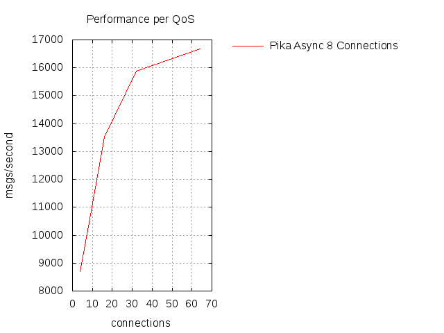

==========================================
AMQP from Python, advanced design patterns
==========================================

* Pau Freixes `@pfreixes`_ and Arnau Orriols `@Arnau_Orriols`_
* Core engineers working at M2M Cloud Factory S.L designing and implementing MIIMETIQ.
* MIIMETIQ is a framework for IoT that uses Python and the following technologies:

  * **Pika**, **Celery**, Flask, Twisted, Tornado, Eve
  * **Rabbitmq**, MongoDB, Graphite, uWSGI, NGINX
  * Ansible
  * PyTest
  * and so on

* This talk is just a selection of two years of experience using AMQP with Python.
* We will try to bring our audience from the basics of AMQP with Python to something called *advanced*
* The whole talk and code used can be *forked* from git https://github.com/pfreixes/python-amqp-pycones
* do you need more technical stuff? Read this `post`_

.. _@pfreixes: https://twitter.com/pfreixes
.. _@Arnau_Orriols: https://twitter.com/Arnau_Orriols
.. _post: http://spring.io/blog/2011/04/01/routing-topologies-for-performance-and-scalability-with-rabbitmq/

Basics of AMQP
===============

* The Advanced Message Queuing Protocol (AMQP) is an open standard application layer protocol for message-oriented middleware
* An stable specification *1.0* is available but nobody uses it, everyone continues on *0.9* specification. Don't ask please.
* One of the most succesful, and open source implementation is `RabbitMQ`_. 

.. image:: static/rabbitmq.png

* Basics concepts of AMQP are: *queues*, *consumers*, *publishers*, *exhcanges*, *bindings*.
* Basics implementations using previous concepts are just a publish-subscribe pattern 

.. image:: static/publisher-consumer-basic.png

But AMQP is an specification that allows us to build different architectures to model our business logic in a decoupled way
getting the advantages of the protocol specification.

.. _RabbitMQ: https://www.rabbitmq.com/

Python meet AMQP
================

Python has a mature and a wide ecosystem of drivers that implement the AMQP protocol.
Some of them and its main characteristics are:

* `Celery`_ Distributed Task Queue with steroids.  Was initially implemented only over AMQP but became a *bloated* software. Other pieces of software such as **librabbitmq** or **kombu** were born thanks to Celery and by the same author `Ask`_
* `Pika`_ Implements both asynchronous and synchronous pattern. Luckily several people has continued its development. 
* `txAMQP`_ Driver for Twisted. Asynchronous pattern.
* `rabbitpy`_ The new kid of `Gavin M Roy`_. He launches it as a main developer of *Pika* may be exhausted with the multi pattern compatibility of Pika. Only thread-safe implementation.
* `py-amqplib`_ Implementation of the 0.8 specification. Currently not being developed.
* `py-amqp`_ Fork from py-amqplib, created by `Ask`_ and the Celery project.
* `librabbitmq`_ Python bindings to rabbitmq-c, created by `Ask`_ and the Celery project.

.. _Celery : https://github.com/celery/celery
.. _Pika : https://github.com/pika/pika
.. _rabbitpy : https://github.com/gmr/rabbitpy
.. _txAMQP : https://pypi.python.org/pypi/txAMQP
.. _Gavin M Roy : https://github.com/gmr
.. _librabbitmq : https://github.com/celery/librabbitmq
.. _py-amqp : https://github.com/celery/py-amqp
.. _py-amqplib : https://github.com/barryp/py-amqplib
.. _Ask : https://github.com/ask

Example of a complex AMQP architecture
======================================

The following image displays a complex AMQP architecture that implements the next features:

* Decouple intensive and CPU bound operations from the Flask code to isolated consumers
* Route the messages published by Devices to the DB applying Authentication, Authorization and fair scheduling.
* Notice users logged into the system about new events such as Device messages in real time.

Example of a complex AMQP architecture
======================================

.. image:: static/advanced-topology__VGA.png 

Bottleneck points
=================

The following list are a set of rules to consider about resource contention and bottlenecks that are usually faced when implementing AMQP architectures:

* Latency between the Queue and the Consumer. Increase the QoS of the Consumer.
* Message contention because of the FIFO Queue. Spread messages to many queues and consume from them using an almost fairness algorithm.
* Consumer throughput. Scale vertical using concurrence and/or parallelism, and/or scale horizontal using RabbitMQ clustering.
* Queue Binding is by itself expensive. Use Exchange two Exchange in dynamic subscribe and unsubscribe environments.
* Consume of memory by queues, exchanges, connections and channels.
* And *Python* by it self.

Celery: From the tutorial to the real world
===========================================

Celery is an asynchronous, distributed task queue. Thanks to using a message-oriented middleware like RabbitMQ, it achieves:

* Superb transport performance
* Queue and results durability
* Scaling flexibility through complex routing
* Execution over a distributed network of workers
* High availability.

... Although it also supports other brokers like Redis, MongoDB,...

Celery: From the tutorial to the real world
===========================================

Use case:

* An HTTP server (Flask)
* An HTTP client (requests)
* An asynchronous task queue (Celery)

We'll iterate over the tutorial-simple scenario facing some of the previously listed bottlenecks, seeing
what tools Celery provides us to solve them. 

Celery: From the tutorial to the real world
===========================================

The tutorial:

.. code-block:: python

    from celery import Celery

    app = Celery('tasks', backend='amqp://', broker='amqp://')
    app.conf.update({
        'CELERY_TRACK_STARTED': True,
    })

    @app.task(name='my_task')
    def my_task(task_name):
        return 'Hello, World, task {}!'.format(task_name)

    if __name__ == '__main__':
        result = my_task.apply_async(args=['foo'])
        print 'Task enqueued, go get a coffee...'
        print 'Task result:', result.get()

Run worker:

.. code-block:: bash
    
    $ celery worker -A module

Run the client:

.. code-block:: bash
    
    $ python module.py
    Task enqueued, go get a coffee...
    Task result: Hello, World, task foo!

Celery: From the tutorial to the real world
===========================================

... Under the hood:

* `app.task` decorator does 2 things:
    * Builds a `celery.app.task.Task` instance that will act as the client interface.
    * Registers the callable into the tasks registry of the Celery app, by name. 

* my_task is an instance of `Task`; it contains all the API methods to schedule the execution of the task:
    * apply_async(args=[], kwargs={}, countdown=0, eta=now, expires=None, retry=None,...)
    * delay
    * retry
    * Canvas workflow: s(), si(), map(), starmap()...

* apply_async returns an `AsyncResult`, used to track the status of the task and to retrieve the result.

Celery: From the tutorial to the real world
===========================================

... Under the hood:

* When the worker starts up, it **imports the celery app module**,
  opens AMQP connection to RabbitMQ, declares the needed queues, and start
  consuming from them.

* When calling apply_async, an AMQP message **with the name of the task** is published to RabbitMQ, routed through the exchange
  topology until reaches the corresponding destination queues, waiting to be consumed by the queue's workers.

* When the worker receives a message, looks up in the tasks registry for the callable corresponding to the task name received and executes it, with the args and kwargs sent alongside the task name.

* The worker publishes the result of the task to the designated results backend.

Celery: From the tutorial to the real world
===========================================

Where to go from there:

#. Scaling vertically.
#. Scaling horizontally.
#. Worker specialization.
#. Dynamic routing.
#. Polyglot integration.

Fair scheduling
===============

... or fair Consuming. The following graphic shows a scenario with many publishers sending messages to one exchange that has bound
a queue that sends messages to one Consumer. 

.. image:: static/unfair_queue_consuming.png

Can we **guarantee that all publishers - not messages - have the same chance to be attended at some specific time**? We can't, but should we? Yes, we should.
The following graphic shows a new architecture that implements a fair scheduling using as many queues as many publishers there are, giving to each
publisher the same chance.

.. image:: static/fair_queue_consuming.png

Fair scheduling : Considering the throughput
============================================

As we saw before at `Bottleneck points`_ slides, there are a set of points that have to be considered to improve the Consumer throughput, to
process messages as fast as we can.

* Scale vertically of the Consumer using concurrence or parallelism.
  
  * Which is the best cardinality between queues N and consumers M ? How to perform the different N:M cardinality?
  * Which is the best pattern to implement the multiple consumers paradigm? Concurrence or Parallelism?

* Reducing the latency between the Queue and the Consumer increasing the QoS.

  * Witch is the best QoS ?

We will find out all of these questions using a **Pika** implementation and comparing it with other drivers.

Fair scheduling : Pika parallelism
==================================

Pika implements a Blocking Adapter with a kind and easy interface to implement Consumers. The following code shows an example
that launches N connections - one per thread - and wait until all messages have been consumed.

.. code-block:: python

    MESSAGES = 100
    QUEUES = 50
    CONNECTIONS = 32

    class Consumer(threading.Thread):
        def __init__(self, *args, **kwargs):
            self._queues = 0
            self._connection = pika.BlockingConnection(pika.ConnectionParameters(host='localhost'))
            self._channel = self._connection.channel()
            self._channel.basic_qos(prefetch_size=0, prefetch_count=1, all_channels=True)
            threading.Thread.__init__(self, *args, **kwargs)

        def add_queue(self, queue):
            self._queues += 1
            self._channel.basic_consume(self._callback, queue=queue)

        def _callback(self, channel, method, properties, message):
            self._channel.basic_ack(delivery_tag=method.delivery_tag)
            self._rx += 1
            if self._rx == (MESSAGES * self._queues):
                self._channel.stop_consuming()

        def run(self):
            self._channel.start_consuming()

    threads = [Consumer() for i in xrange(0,  CONNECTIONS)]
    map(lambda tq: tq[0].add_queue('queue_{}'.format(tq[1])), izip(cycle(threads), xrange(0, QUEUES)))
    map(lambda thread: thread.start(), threads)
    map(lambda thread: thread.join(), threads)

Fair scheduling : Pika concurrence
==================================

Pika implements an Asynchronous Adapter with a callback pattern to implement Consumers. The following code shows an example
that launches N connections sharing the same ioloop and wait until all messages have been consumed.

.. code-block:: python

    MESSAGES = 100
    QUEUES = 50
    CONNECTIONS = 32

    ioloop = pika.adapters.select_connection.IOLoop()
    consumers_finsihed = [False] * CONNECTIONS

    class Consumer(object):
        def __init__(self, id_):
            self._id = id_
            self._connection = pika.SelectConnection(
                pika.ConnectionParameters(host='localhost', socket_timeout=1000),
                self.on_connection_open, custom_ioloop=ioloop, stop_ioloop_on_close=False)

        def on_connection_open(self, unused_connection):
            self._connection.add_on_close_callback(self.on_connection_closed)
            self._connection.channel(on_open_callback=self.on_channel_open)

        def on_channel_open(self, channel):
            self._channel = channel
            self._channel.add_on_close_callback(self.on_channel_closed)
            self._channel.basic_qos(prefetch_size=0, prefetch_count=1, all_channels=True)
            self._channel.add_on_cancel_callback(self.on_consumer_cancelled)
            for queue in self._queue_names:
                self._channel.basic_consume(self.on_message, queue)

Fair scheduling : Pika concurrence
==================================

.. code-block:: python

        def add_queue(self, queue_name):
            self._queue_names.append(queue_name)

        def on_message(self, basic_deliver, properties, message):
            self._channel.basic_ack(basic_deliver.delivery_tag)
            self._rx += 1
            if self._rx == (MESSAGES * len(self._queue_names)):
                consumers_finished[self._id] = True
                if all(consumers_finished):
                    ioloop.stop()

    consumers = [Consumer(i) for i in xrange(0,  CONNECTIONS)]
    map(lambda tq: tq[0].add_queue('queue_{}'.format(tq[1])), izip(cycle(consumers), xrange(0, QUEUES)))
    ioloop.start()

Fair scheduling : Concurrence vs Parallelism
============================================

The following graph compares the behaviour of the Asynchronous and Threading Pika implementation consuming 5K messages
from 100 queues using 2, 4, 8, 16 and 32 connections.

.. image:: static/many_queues_without_librabbitmq.png

Fair scheduling : Pika concurrence with QoS > 1
===============================================

Another way to increment the throughput of the worker is try to reduce the latence between the Consumer and the Broker, AMQP specifies a field
called QoS that represents the number of messages that the Broker can send publish without get one ack. The QoS used by one Consumer is always
by default 1.

If the Consumer decides to use a channel with a QoS value greater than 1 the buffers belonging to the Operating System could store messages that
have not been consumed still incrementing as a side effect the memory consumption. Once the Consumer decides to `ack`_ one message it can use the 
multiple flag confirming automatically all previous messages.

We implemented a *Pika Asyncronous* that tries with different QoS value, getting the following results:

.. _ack : https://www.rabbitmq.com/confirms.html

Fair scheduling : Python is slow by nature, the yield overhead
==============================================================

`Somebody`_ believes that in **short latency and fast tasks environments** threading patterns perform better than 
asynchronous patterns, even with the Python GIL drawback.

**Can you guess which is the reason behind this sentence ?**

.. _Somebody : http://techspot.zzzeek.org/2015/02/15/asynchronous-python-and-databases/

Fair scheduling :  Python is slow by nature, the yield overhead 
===============================================================

These people argue that Python is enough slow to spend more time running the asyncronous stack than performing IO operations.

.. code:: bash

                             Time spent
    +-------+---------------------------------------+--------+
    | Input |         Python Asyncronous Code       | Output | Thread 1
    +-------+---------------------------------------+--------+
                                        +-------+    +---------------------------------------+--------+
                                        | Input |    |         Python Asyncronous Code       | Output | Thread 1
                                        +-------+    +---------------------------------------+--------+
                                                      
Therefore threading patterns with straightforward Python code performs better.

.. code:: bash

                                  _ _ _ _ GIL Released
                                 /
                                 |
               Time spent        |
    +-------+--------------------+--------+
    | Input |     Python Code    | Output |  Thread 1
    +-------+--------------------+--------+
                      +-------+   +--------------------+--------+
                      | Input |   |  Python Code       | Output | Thread 2
                      +-------+   +--------------------+--------+
                                  |
                                  |
                                  \_ _ _ _  GIL Adquired

Each time that one *I/O* operation is performed the *GIL* is released, *GIL* won't perturb your multi thread Python code if it 
runs short tasks between many *I/O* operations. We will try to find out how of true is this belief.

Fair scheduling : Python is slow by nature, using a C driver
============================================================

But sometimes we forget how slow can Python be. The following table shows the performance difference between the **Librabbitmq** library
and the best numbers got by the different **Pika** implementations.

.. code:: bash

    +-------------------+---+-----+------------+ 
    | Implementation    | C | QoS | Msg/Second | 
    +===================+===+=====+============+ 
    | Pika Threads      | 64|    1|        4032| 
    +-------------------+---+-----+------------+
    | Pika Async, 64    | 64|    1|        7092| 
    +-------------------+---+-----+------------+
    | Pika QoS, 64 8    |  8|   64|       16129| 
    +-------------------+---+-----+------------+
    | Librabbitmq       |  4|    1|       38461| 
    +-------------------+---+-----+------------+

Most of **Librabbitmq** is written using the *C* language, so the code executed by the Consumer that is handled by the interpreter
is just the consumer callback.

Fair scheduling : All results together
======================================

.. code:: bash

    +-------------------+-------------------------+---------+---------+---------+-------+
    |Name               |Parameters               |     Real|     User|      Sys|  Msg/s|
    +-------------------+-------------------------+---------+---------+---------+-------+
    |Pika_Async         |{'connections': 2}       |     9.93|     2.36|     0.20|   1007|
    |Pika_Threads       |{'connections': 2}       |     9.82|     2.96|     0.25|   1018|
    |Pika_Threads       |{'connections': 4}       |     5.17|     2.72|     0.28|   1934|
    |Pika_Async         |{'connections': 4}       |     4.69|     1.92|     0.14|   2132|
    |Pika_Threads       |{'connections': 8}       |     3.30|     2.51|     0.44|   3030|
    |Pika_Threads       |{'connections': 16}      |     2.95|     2.26|     0.49|   3389|
    |Pika_Async         |{'connections': 8}       |     2.73|     1.67|     0.15|   3663|
    |Pika_Threads       |{'connections': 32}      |     2.65|     2.32|     0.53|   3773|
    |Pika_Threads       |{'connections': 64}      |     2.48|     2.32|     0.68|   4032|
    |Pika_Async         |{'connections': 16}      |     1.84|     1.52|     0.11|   5434|
    |Pika_Async         |{'connections': 32}      |     1.64|     1.39|     0.10|   6097|
    |Pika_Async         |{'connections': 64}      |     1.41|     1.20|     0.11|   7092|
    |Pika_Async_QoS     |{'prefetch': 4}          |     1.16|     1.04|     0.03|   8620|
    |Pika_Async_QoS     |{'prefetch': 8}          |     0.97|     0.77|     0.03|  10309|
    |Pika_Async_QoS     |{'prefetch': 16}         |     0.70|     0.66|     0.00|  14285|
    |Pika_Async_QoS     |{'prefetch': 32}         |     0.63|     0.62|     0.00|  15873|
    |Pika_Async_QoS     |{'prefetch': 64}         |     0.62|     0.60|     0.01|  16129|
    |Librabbitmq_Threads|{'connections': 64}      |     0.41|     0.17|     0.10|  24390|
    |Librabbitmq_Threads|{'connections': 32}      |     0.32|     0.14|     0.08|  31250|
    |Librabbitmq_Threads|{'connections': 16}      |     0.29|     0.10|     0.10|  34482|
    |Librabbitmq_Threads|{'connections': 2}       |     0.27|     0.09|     0.05|  37037|
    |Librabbitmq_Threads|{'connections': 8}       |     0.27|     0.10|     0.08|  37037|
    |Librabbitmq_Threads|{'connections': 4}       |     0.26|     0.09|     0.06|  38461|
    +------------------+-------------------------+---------+---------+---------+--------+

conclusions
===========

