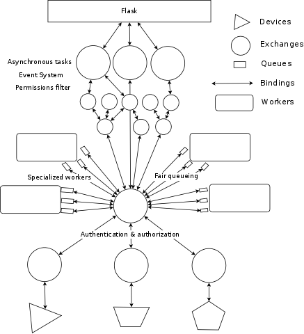

==========================================
AMQP from Python, advanced design patterns
==========================================

* Pau Freixes `@pfreixes`_ and Arnau Orriols `@Arnau_Orriols`_
* Core engineers working at M2M Cloud Factory S.L designing and implementing MIIMETIQ.
* MIIMETIQ is a framework for IoT that uses Python and the following technologies:

  * **Pika**, **Celery**, Flask, Twisted, Tornado, Eve
  * **Rabbitmq**, MongoDB, Graphite, uWSGI, NGINX
  * Ansible
  * PyTest
  * and so on

* This talk is just a good selection of two years of experience using AMQP with Python.
* We will try to move our audience from the basics of AMQP with Python to something called *advanced* 
* The whole talk and code used can be *forked* from git https://github.com/pfreixes/python-amqp-pycones

.. _@pfreixes: https://twitter.com/pfreixes
.. _@Arnau_Orriols: https://twitter.com/Arnau_Orriols

Basics of AMQP
===============

* The Advanced Message Queuing Protocol (AMQP) is an open standard application layer protocol for message-oriented middleware
* An stable specification *1.0* is available but nobody uses it, everyone continues on *0.9* specification. Don't ask please.
* One of the most succesful, and open source implementation is `RabbitMQ`_. 

.. image:: static/rabbitmq.png

* Basics concepts of AMQP are: *queues*, *consumers*, *publishers*, *exhcanges*, *bindings*.
* Basics implementations using previous concepts are just a publish-subscribe pattern 

.. image:: static/publisher-consumer-basic.png

But AMQP is an specification that allows us to build different architectures to model our business logic in a decoupled way
getting the advantages of the protocol specification.

.. _RabbitMQ: https://www.rabbitmq.com/

Python meet AMQP
================

Python has a mature and a wide ecosystem of drivers that implement the AMQP protocol.
Some of them and its main characteristics are:

* `Celery`_ Distributed Task Queue with steroids.  Was initially implemented only over AMQP but became a *bloated* software. Other pieces of software such as **librabbitmq** or **kombu** were born thanks to Celery and by the same author `Ask`_
* `Pika`_ Implements both asynchronous and synchronous pattern. Luckily several people has continued its development. 
* `txAMQP`_ Driver for Twisted. Asynchronous pattern.
* `rabbitpy`_ The new kid of `Gavin M Roy`_. He launches it as a main developer of *Pika* may be exhausted with the multi pattern compatibility of Pika. Only thread-safe implementation.
* `py-amqplib`_ Implementation of the 0.8 specification. Currently not being developed.
* `py-amqp`_ Fork from py-amqplib, created by `Ask`_ and the Celery project.
* `librabbitmq`_ Python bindings to rabbitmq-c, created by `Ask`_ and the Celery project.

.. _Celery : https://github.com/celery/celery
.. _Pika : https://github.com/pika/pika
.. _rabbitpy : https://github.com/gmr/rabbitpy
.. _txAMQP : https://pypi.python.org/pypi/txAMQP
.. _Gavin M Roy : https://github.com/gmr
.. _librabbitmq : https://github.com/celery/librabbitmq
.. _py-amqp : https://github.com/celery/py-amqp
.. _py-amqplib : https://github.com/barryp/py-amqplib
.. _Ask : https://github.com/ask

Example of a complex AMQP architecture
======================================

The following image displays a complex AMQP architecture that implements the next features:

* Decouple intensive and CPU bound operations from the Flask code to isolated consumers
* Route the messages published by Devices to the DB applying Authentication, Authorization and fair scheduling.
* Notice users logged into the system about new events such as Device messages in real time.

Example of a complex AMQP architecture
======================================

Bottleneck points
=================

The following list are a set of rules to consider about resource contention and bottlenecks that are usually faced when implementing AMQP architectures:

* Latence between the Queue and the Consumer. Increase the QoS of the Consumer.
* Message contention because of the FIFO Queue. Spread messages to many queues and consume from them using an almost fairness algorithm.
* Consumer throughput. Scale vertical using concurrence and/or parallelism and/or scale horizontal using RabbitMQ clustering.
* Queue Binding is by it self expensive. Use Exchange two Exchange in dynamic subscribe and unsubscribe environments.
* Consume of memory by queues, exchanges, connections and channels.
* And *Python* by it self.

Celery
======

bar

many_queues
===============

foo

conclusions
===============

bar

bar
