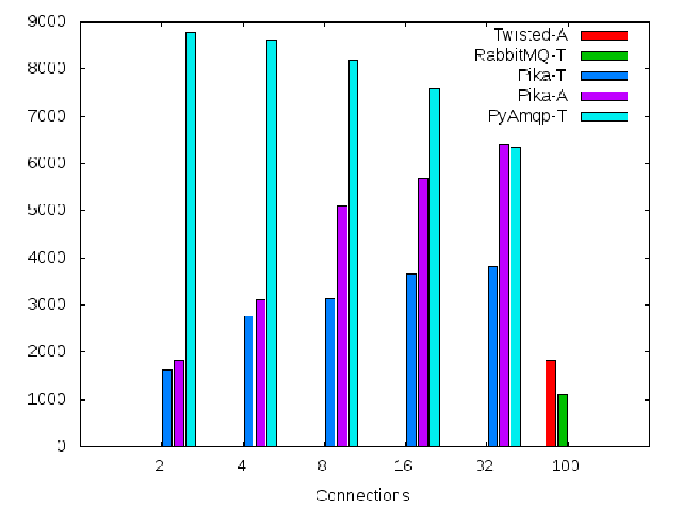
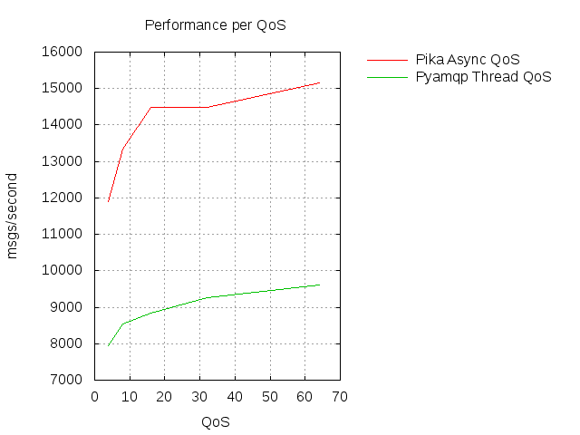

==========================================
AMQP from Python, advanced design patterns
==========================================

* Pau Freixes `@pfreixes`_ and Arnau Orriols `@Arnau_Orriols`_
* Core engineers working at M2M Cloud Factory S.L designing and implementing MIIMETIQ.
* MIIMETIQ is a framework for IoT that uses Python and the following technologies:

  * **Pika**, **Celery**, Flask, Twisted, Tornado, Eve
  * **Rabbitmq**, MongoDB, Graphite, uWSGI, NGINX
  * Ansible
  * PyTest
  * and so on

* This talk is just a selection of two years of experience using AMQP with Python.
* We will try to bring our audience from the basics of AMQP with Python to something called *advanced*
* The whole talk and code used can be *forked* from git https://github.com/pfreixes/python-amqp-pycones
* do you need more technical stuff? Read this `post`_

.. _@pfreixes: https://twitter.com/pfreixes
.. _@Arnau_Orriols: https://twitter.com/Arnau_Orriols
.. _post: http://spring.io/blog/2011/04/01/routing-topologies-for-performance-and-scalability-with-rabbitmq/

Basics of AMQP
===============

* The Advanced Message Queuing Protocol (AMQP) is an open standard application layer protocol for message-oriented middleware
* An stable specification *1.0* is available but nobody uses it, everyone continues on *0.9* specification. Don't ask please.
* One of the most succesful, and open source implementation is `RabbitMQ`_. 

* Basics concepts of AMQP are: *queues*, *consumers*, *publishers*, *exhcanges*, *bindings*.
* Basics implementations using previous concepts are just a publish-subscribe pattern 

.. image:: static/publisher-consumer-basic.png

But AMQP is an specification that allows us to build different architectures to model our business logic in a decoupled way
getting the advantages of the protocol specification.

.. _RabbitMQ: https://www.rabbitmq.com/

Python meet AMQP
================

Python has a mature and a wide ecosystem of drivers that implement the AMQP protocol.
Some of them and its main characteristics are:

* `Celery`_ Distributed Task Queue with steroids.  Was initially implemented only over AMQP but became a *bloated* software. Other pieces of software such as **librabbitmq** or **kombu** were born thanks to Celery and by the same author `Ask`_
* `Pika`_ Implements both asynchronous and synchronous pattern. Luckily several people has continued its development. 
* `txAMQP`_ Driver for Twisted. Asynchronous pattern.
* `rabbitpy`_ The new kid of `Gavin M Roy`_. He launches it as a main developer of *Pika* may be exhausted with the multi pattern compatibility of Pika. Only thread-safe implementation.
* `py-amqplib`_ Implementation of the 0.8 specification. Currently not being developed.
* `py-amqp`_ Fork from py-amqplib, created by `Ask`_ and the Celery project.
* `librabbitmq`_ Python bindings to rabbitmq-c, created by `Ask`_ and the Celery project.

.. _Celery : https://github.com/celery/celery
.. _Pika : https://github.com/pika/pika
.. _rabbitpy : https://github.com/gmr/rabbitpy
.. _txAMQP : https://pypi.python.org/pypi/txAMQP
.. _Gavin M Roy : https://github.com/gmr
.. _librabbitmq : https://github.com/celery/librabbitmq
.. _py-amqp : https://github.com/celery/py-amqp
.. _py-amqplib : https://github.com/barryp/py-amqplib
.. _Ask : https://github.com/ask

Example of a complex AMQP architecture
======================================

The following image displays a complex AMQP architecture that implements the next features:

* Decouple intensive and CPU bound operations from the Flask code to isolated consumers
* Route the messages published by Devices to the DB applying Authentication, Authorization and fair scheduling.
* Notice users logged into the system about new events such as Device messages in real time.

Example of a complex AMQP architecture
======================================

.. image:: static/advanced-topology__VGA.png 

Bottleneck points
=================

The following list are a set of rules to consider about resource contention and bottlenecks that are usually faced when implementing AMQP architectures:

* Latency between the Queue and the Consumer. Increase the QoS of the Consumer.
* Message contention because of the FIFO Queue. Spread messages to many queues and consume from them using an almost fairness algorithm.
* Consumer throughput. Scale vertical using concurrence and/or parallelism, and/or scale horizontal using RabbitMQ clustering.
* Queue Binding is by itself expensive. Use Exchange two Exchange in dynamic subscribe and unsubscribe environments.
* Consume of memory by queues, exchanges, connections and channels.
* And *Python* by it self.

Celery: From the tutorial to the real world
===========================================

Celery is an asynchronous, distributed task queue. Thanks to using a message-oriented middleware like RabbitMQ, it achieves:

* Superb transport performance
* Queue and results durability
* Scaling flexibility through complex routing
* Execution over a distributed network of workers
* High availability.

... Although it also supports other brokers like Redis, MongoDB,...

Celery: From the tutorial to the real world
===========================================

Use case:

* An HTTP server (Flask)
* An HTTP client (requests)
* An asynchronous task queue (Celery)

We'll iterate over the tutorial-simple scenario facing some of the previously listed bottlenecks, seeing
what tools Celery provides us to solve them. 

Celery: From the tutorial to the real world
===========================================

The tutorial:

.. code-block:: python

    from celery import Celery

    app = Celery('tasks', backend='amqp://', broker='amqp://')
    app.conf.update({
        'CELERY_TRACK_STARTED': True,
    })

    @app.task(name='my_task')
    def my_task(task_name):
        return 'Hello, World, task {}!'.format(task_name)

    if __name__ == '__main__':
        result = my_task.apply_async(args=['foo'])
        print 'Task enqueued, go get a coffee...'
        print 'Task result:', result.get()

Run worker:

.. code-block:: bash
    
    $ celery worker -A module

Run the client:

.. code-block:: bash
    
    $ python module.py
    Task enqueued, go get a coffee...
    Task result: Hello, World, task foo!

Celery: From the tutorial to the real world
===========================================

... Under the hood:

* `app.task` decorator does 2 things:
    * Builds a `celery.app.task.Task` instance that will act as the client interface.
    * Registers the callable into the tasks registry of the Celery app, by name. 

* my_task is an instance of `Task`; it contains all the API methods to schedule the execution of the task:
    * apply_async(args=[], kwargs={}, countdown=0, eta=now, expires=None, retry=None,...)
    * delay
    * retry
    * Canvas workflow: s(), si(), map(), starmap()...

* apply_async returns an `AsyncResult`, used to track the status of the task and to retrieve the result.

Celery: From the tutorial to the real world
===========================================

... Under the hood:

* When the worker starts up, it **imports the celery app module**,
  opens AMQP connection to RabbitMQ, declares the needed queues, and start
  consuming from them.

* When calling apply_async, an AMQP message **with the name of the task** is published to RabbitMQ, routed through the exchange
  topology until reaches the corresponding destination queues, waiting to be consumed by the queue's workers.

* When the worker receives a message, looks up in the tasks registry for the callable corresponding to the task name received and executes it, with the args and kwargs sent alongside the task name.

* The worker publishes the result of the task to the designated results backend.

Celery: From the tutorial to the real world
===========================================

Where to go from there:

#. Scaling vertically.
#. Scaling horizontally.
#. Worker specialization.
#. Dynamic routing.
#. Polyglot integration.

Celery: From the tutorial to the real world
===========================================

**Scaling vertically**. As the message frequency increases, the first step is to increase the worker throughput, and Celery gives this for free:

Concurrency Pools:

* prefork (default)
* threads (experimental)
* Eventlet (still scary)
* Gevent (still scary)

Start a worker with N processes/threads/greenthreads:

.. code-block:: bash

        $ celery worker -A module -P <pool> -c <concurrency-slots>

Celery: From the tutorial to the real world
===========================================

**Scaling horizontally**. Regardless of the pool used, at certain point increasing the concurrency-slots
of the worker's pool will start to affects the worker's performance negatively. 

* Careful with the prefetch_count of the consumer, or you might find tasks waiting in a worker's buffer while other nodes are idle. 
* PREFETCH_MULTIPLIER: Celery handles this in a clever way. You configure the number of tasks waiting in the buffer for each concurrency-slot.

**Worker specialization**. Also, if workers consume any kind of task, we can end up with fast task starved because more expensive tasks are blocking
the worker nodes. 

Celery routing facilities:

* CELERY_ROUTES: task \*..1 queue mapping
* CELERY_QUEUES: Detailed definition of queues, including:
    * Exchange to which binded
    * Routing key of the binding

Tell each worker node from which queue to consume:

.. code-block:: bash

        $ celery worker -A module -Q <queue>,<queue>

Celery: From the tutorial to the real world
===========================================

**Dynamic routing**. With the previous Celery features, a very complex AMQP topology can be declared, and Celery will take care of the creation
and binding of queues and exchanges. But this declaration is static, and we might need the capabilities to act dynamically upon it.

1. Tell the worker to consume from a queue at runtime:

.. code-block:: python

    queue_name = 'expensive-{}'.format(session_token)
    worker_app.control.add_consumer(
        queue=queue_name,
        destination=['expensive-task@worker']
    )

2. Specify the destination queue at task's schedule time:

.. code-block:: python

    queue_name = 'expensive-{}'.format(session_token)
    task_result = expensive_task.apply_async(queue=queue_name)

Celery: From the tutorial to the real world
===========================================

**Polyglot Integration**. Finally, down the rabbit hole. Regardless of the bloated software that Celery is now, essentially it is build upon a quite simple protocol:

Which can be implemented by hand in any language with an AMQP client library, both client and worker.

Fair scheduling
===============

... or fair Consuming. The following graphic shows a scenario with many publishers sending messages to one exchange that has bound
a queue that sends messages to one Consumer. 

.. image:: static/unfair_queue_consuming.png

Can we **guarantee that all publishers - not messages - have the same chance to be attended at some specific time**? We can't, but should we? Yes, we should.
The following graphic shows a new architecture that implements a fair scheduling using as many queues as many publishers there are, giving to each
publisher the same chance.

.. image:: static/fair_queue_consuming.png

Fair scheduling : Considering the throughput
============================================

To **process messages as fast as we can** we will: 

* **Scale vertically** of the Consumer using concurrence or parallelism.
  
  * Which is the best pattern Concurrence or Parallelism?
  * Which is the best cardinality between queues N and consumers M ? How perform N:M 

* **Reducing the latency** between the Queue and the Consumer increasing the QoS.

  * Which is the best QoS ?

Fair scheduling : Concurrence or Parallelism 
============================================

The idea is **scale the consumer adding more execution flows**. Two aproximations : 

* **Threading**, Drivers with bloking *I/O*:

    * Rabbitpy
    * Pyamqp
    * Pika

* **Asyncronous**, Drivers supporting none bloking *I/O*:

    * Pika
    * Twisted

For each implementation we ran several times the same experiment using 2, 4, 8 and so on until get the first number 
lesser than the number of queues divided by 2.

Fair scheduling : Concurrence vs Parallelism
============================================

**Asynchronous vs Threading** results: 

  * 100 queues
  * 10K messages
  * using 2, 4, 8, 16 and 32 connections.
  * Twisted and Rabbitpy just with 100 connections.

Fair scheduling : Concurrence vs Parallelism 
============================================

We thought that the threading patterns used by Python programs were a bad choose because of the GIL. 

* `Somebody`_ believes that **short latency and fast tasks environments** threading patterns perform better than asynchronous patterns.
* Even with the **Python GIL drawback**.

**Can you guess which is the reason?**

.. _Somebody : http://techspot.zzzeek.org/2015/02/15/asynchronous-python-and-databases/

Fair scheduling : Concurrence vs Parallelism 
============================================

These people argue that **Python is enough slow** to spend more time running the asyncronous stack than waiting for IO operations.

This chart explains how a Python code running on top of an asyncronous pattern is executed.

.. code:: bash

                             Time spent
    +-------+---------------------------------------+--------+
    | Input |         Python Asyncronous Code       | Output | Thread 1
    +-------+---------------------------------------+--------+
                                        +-------+    +---------------------------------------+--------+
                                        | Input |    |         Python Asyncronous Code       | Output | Thread 1
                                        +-------+    +---------------------------------------+--------+
                                                      
And the same execution flow running on top of a threading patterns with a less Python footprint performs better.

.. code:: bash

                                  _ _ _ _ GIL Released
                                 /
                                 |
               Time spent        |
    +-------+--------------------+--------+
    | Input |     Python Code    | Output |  Thread 1
    +-------+--------------------+--------+
                      +-------+   +--------------------+--------+
                      | Input |   |  Python Code       | Output | Thread 2
                      +-------+   +--------------------+--------+
                                  |
                                  |
                                  \_ _ _ _  GIL Adquired

Each time that one *I/O* operation is performed the *GIL* is released, *GIL* **shouldn't perturb your multi thread Python code** if it 
runs short tasks between many *I/O* operations.

Fair scheduling : Concurrence/Parallelism + QoS > 1
===================================================

We picked up the best ones from the previous experiments: **Pika Asyncronous** and **PyAamqp Thread**

**Reduced the latence** between the Consumer and the Broker: 

    * Using a *QoS* value greater than 1.
    * Using the multiple flag to `ack`_  many messages at once.

.. _ack : https://www.rabbitmq.com/confirms.html

air scheduling : Concurrence/Parallelism + QoS > 1
===================================================

.. _ack : https://www.rabbitmq.com/confirms.html

Fair scheduling : And there was light
=====================================

* The *Real* time is the **Python code belonging to the full stack : driver + test code**
* The *Sys* time is the **time consumed by the kernel code path used by the syscalls**.

.. code:: bash

    +-------------------+-------------------------+---------+---------+---------+-------+
    |Name               |Parameters               |     Real|     User|      Sys|  Msg/s|
    +-------------------+-------------------------+---------+---------+---------+-------+
    |Pika_Async         |{'connections': 32}      |     1.60|     1.39|     0.09|   6250|
    |Pyamqp_Threads     |{'connections': 2}       |     1.10|     1.02|     0.37|   9090|
    |Pyamqp_Threads_QoS |{'prefetch': 4}          |     1.26|     1.03|     0.46|   7936|
    |Pyamqp_Threads_QoS |{'prefetch': 8}          |     1.17|     0.98|     0.36|   8547|
    |Pyamqp_Threads_QoS |{'prefetch': 16}         |     1.13|     0.93|     0.53|   8849|
    |Pyamqp_Threads_QoS |{'prefetch': 32}         |     1.08|     0.93|     0.38|   9259|
    |Pyamqp_Threads_QoS |{'prefetch': 64}         |     1.04|     0.97|     0.48|   9615|
    |Pika_Async_QoS     |{'prefetch': 4}          |     0.84|     0.80|     0.02|  11904|
    |Pika_Async_QoS     |{'prefetch': 8}          |     0.75|     0.72|     0.02|  13333|
    |Pika_Async_QoS     |{'prefetch': 16}         |     0.69|     0.66|     0.02|  14492|
    |Pika_Async_QoS     |{'prefetch': 64}         |     0.69|     0.67|     0.01|  14492|
    |Pika_Async_QoS     |{'prefetch': 32}         |     0.66|     0.63|     0.02|  15151|
    +------------------+-------------------------+---------+---------+---------+--------+

Fair scheduling : And there was light
=====================================

* Pika, Pyamqp

    * **we reduced the I/O waits almost to zero**, *Real* time is close to the *User* + *Sys*.
    * **we reduced the User time because of the QoS**, removes a lot of expensive calls to perform ack.

* Pyamqp

    * **Real time lesser than the User + Sys**, why?

* Pika
    * **Sys time used by is almost zero**, the *select* call returns inmediatly.

Fair scheduling : And there was light
=====================================

But both of them have reduced almost the foot print of the ack:

    * **Pika** *351ms* -> *14ms*
    * **Pyamqp** *218ms* -> *15ms*

Is this difference enought to explain the **two times difference** of message/seconds consumed ?

.. code:: bash

    ncalls  tottime  percall  cumtime  percall filename:lineno(function)
    10000     0.025    0.000    0.351    0.000 pika/channel.py:140(basic_ack)
      328     0.001    0.000    0.014    0.000 pika(channel.py:140(basic_ack)

    ncalls  tottime  percall  cumtime  percall filename:lineno(function)
    10000     0.018    0.000    0.218    0.000 amqp/channel.py:1534(basic_ack)
      313     0.001    0.000    0.015    0.000 amqp/channel.py:1534(basic_ack)

Legend:

  * **tottime** Time spent by the function by it self
  * **percall** tottime/ncalls
  * **cumtime** Cumulative time spent by the function. 

Fair scheduling : And there was light
=====================================

No, *Pika* performs better than *Pyamqp* because of how their are handling the connections:

    * Pika uses a **explict connecion switching** made by the **select** syscall.
    * Pyamqp uses a **implict connection switching** made by the **SO**. The **GIL doesn't help**.

Fair scheduling : Python is slow by nature, using a C driver
============================================================

**Pure Python vs C + Python** results: 

.. code:: bash

    +-------------------+---+-----+------------+ 
    | Implementation    | C | QoS | Msg/Second | 
    +===================+===+=====+============+ 
    +-------------------+---+-----+------------+
    | Pika Async        | 32|   32|       15151| 
    +-------------------+---+-----+------------+
    | Librabbitmq       |  4|    1|       38461| 
    +-------------------+---+-----+------------+

Most of **Librabbitmq** is written using the *C* language, so the code executed by the consumer that is handled by the Python interpreter
is just the consumer callback.

The numbers in raw:

.. code:: bash

    +-------------------+-------------------------+---------+---------+---------+-------+
    |Name               |Parameters               |     Real|     User|      Sys|  Msg/s|
    +-------------------+-------------------------+---------+---------+---------+-------+
    |Pika_Async_QoS     |{'prefetch': 32}         |     0.66|     0.63|     0.02|  15151|
    |Librabbitmq_Threads|{'connections': 2}       |     0.26|     0.08|     0.05|  38461|
    +-------------------+-------------------------+---------+---------+---------+-------+
 
conclusions
===========

