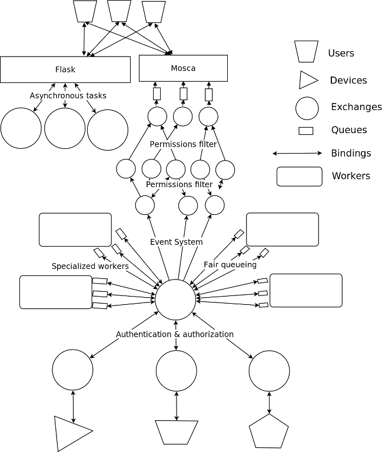

==========================================
AMQP from Python, advanced design patterns
==========================================

* Pau Freixes `@pfreixes`_ and Arnau Orriols `@Arnau_Orriols`_
* Core engineers working at M2M Cloud Factory S.L designing and implementing MIIMETIQ.
* MIIMETIQ is a framework for IoT that uses Python and the following technologies:

  * **Pika**, **Celery**, Flask, Twisted, Tornado, Eve
  * **Rabbitmq**, MongoDB, Graphite, uWSGI, NGINX
  * Ansible
  * PyTest
  * and so on

* This talk is just a good selection of two years of experience using AMQP with Python.
* We will try to move our audience from the basics of AMQP with Python to something called *advanced* 
* The whole talk and code used can be *forked* from git https://github.com/pfreixes/python-amqp-pycones

.. _@pfreixes: https://twitter.com/pfreixes
.. _@Arnau_Orriols: https://twitter.com/Arnau_Orriols

Basics of AMQP
===============

* The Advanced Message Queuing Protocol (AMQP) is an open standard application layer protocol for message-oriented middleware
* An stable specification *1.0* is available but nobody uses it, everyone continues on *0.9* specification. Don't ask please.
* One of the most succesful, and open source implementation is `RabbitMQ`_. 

.. image:: static/rabbitmq.png

* Basics concepts of AMQP are: *queues*, *consumers*, *publishers*, *exhcanges*, *bindings*.
* Basics implementations using previous concepts are just a publish-subscribe pattern 

.. image:: static/publisher-consumer-basic.png

But AMQP is an specification that allows us to build different architectures to model our business logic in a decoupled way
getting the advantages of the protocol specification.

.. _RabbitMQ: https://www.rabbitmq.com/

Python meet AMQP
================

Python has a mature and a wide ecosystem of drivers that implement the AMQP protocol.
Some of them and its main characteristics are:

* `Celery`_ Distributed Task Queue with steroids.  Was initially implemented only over AMQP but became a *bloated* software. Other pieces of software such as **librabbitmq** or **kombu** were born thanks to Celery and by the same author `Ask`_
* `Pika`_ Implements both asynchronous and synchronous pattern. Luckily several people has continued its development. 
* `txAMQP`_ Driver for Twisted. Asynchronous pattern.
* `rabbitpy`_ The new kid of `Gavin M Roy`_. He launches it as a main developer of *Pika* may be exhausted with the multi pattern compatibility of Pika. Only thread-safe implementation.
* `py-amqplib`_ Implementation of the 0.8 specification. Currently not being developed.
* `py-amqp`_ Fork from py-amqplib, created by `Ask`_ and the Celery project.
* `librabbitmq`_ Python bindings to rabbitmq-c, created by `Ask`_ and the Celery project.

.. _Celery : https://github.com/celery/celery
.. _Pika : https://github.com/pika/pika
.. _rabbitpy : https://github.com/gmr/rabbitpy
.. _txAMQP : https://pypi.python.org/pypi/txAMQP
.. _Gavin M Roy : https://github.com/gmr
.. _librabbitmq : https://github.com/celery/librabbitmq
.. _py-amqp : https://github.com/celery/py-amqp
.. _py-amqplib : https://github.com/barryp/py-amqplib
.. _Ask : https://github.com/ask

Example of a complex AMQP architecture
======================================

The following image displays a complex AMQP architecture that implements the next features:

* Decouple intensive and CPU bound operations from the Flask code to isolated consumers
* Route the messages published by Devices to the DB applying Authentication, Authorization and fair scheduling.
* Notice users logged into the system about new events such as Device messages in real time.

Example of a complex AMQP architecture
======================================

Bottleneck points
=================

The following list are a set of rules to consider about resource contention and bottlenecks that are usually faced when implementing AMQP architectures:

* Latence between the Queue and the Consumer. Increase the QoS of the Consumer.
* Message contention because of the FIFO Queue. Spread messages to many queues and consume from them using an almost fairness algorithm.
* Consumer throughput. Scale vertical using concurrence and/or parallelism, and/or scale horizontal using RabbitMQ clustering.
* Queue Binding is by itself expensive. Use Exchange two Exchange in dynamic subscribe and unsubscribe environments.
* Consume of memory by queues, exchanges, connections and channels.
* And *Python* by it self.

Celery
======

bar

Fair scheduling
===============

... or fair Consuming. The following graphic shows a scenario with many publishers sending messages to one exchange that has bound
a queue that sends messages to one Consumer. 

Can we **guarantee** that all messages have the same **chance** to be **consumed** at some specific time? We can't, but should we? Yes, we should.
The following graphic shows a new architecture that gives as a architecture to implement a fair scheduling using as many queues as many publishers
there are.

Fair scheduling : Considering the throughput
============================================

As we saw before at `Bottleneck points`_ slides, there are a set of points that have to be considered to improve the Consumer throughput, to
process messages as fast as we can. The make that we will implement the following characteristics using the **Pika** driver.

* Scale vertically of the Consumer using concurrence or parallelism.
  
  * Which is the best cardinality between queues N and consumers M ? How to perform the different N:M cardinality?
  * Which is the best pattern to implement the multiple consumers paradigm? Concurrence or Parallelism?

* Reducing the latency between the Queue and the Consumer increasing the QoS.

  * Witch is the best QoS ?

Fair scheduling : Pika parallelism
==================================

Pika implements a Blocking Adapter with a kind and easy interface to implement Consumers. The following code shows an example
that launches N connections - one per thread - and wait until all messages have been consumed.

.. code-block:: python

    MESSAGES = 100
    QUEUES = 50
    CONNECTIONS = 32

    class Consumer(threading.Thread):
        def __init__(self, *args, **kwargs):
            self._queues = 0
            self._connection = pika.BlockingConnection(pika.ConnectionParameters(host='localhost'))
            self._channel = self._connection.channel()
            self._channel.basic_qos(prefetch_size=0, prefetch_count=1, all_channels=True)
            threading.Thread.__init__(self, *args, **kwargs)

        def add_queue(self, queue):
            self._queues += 1
            self._channel.basic_consume(self._callback, queue=queue)

        def _callback(self, channel, method, properties, message):
            self._channel.basic_ack(delivery_tag=method.delivery_tag)
            self._rx += 1
            if self._rx == (MESSAGES * self._queues):
                self._channel.stop_consuming()

        def run(self):
            self._channel.start_consuming()

    threads = [Consumer() for i in xrange(0,  CONNECTIONS)]
    map(lambda tq: tq[0].add_queue('queue_{}'.format(tq[1])), izip(cycle(threads), xrange(0, QUEUES)))
    map(lambda thread: thread.start(), threads)
    map(lambda thread: thread.join(), threads)

Fair scheduling : Pika concurrence
==================================

Pika implements an Asynchronous Adapter with a callback pattern to implement Consumers. The following code shows an example
that launches N connections sharing the same ioloop and wait until all messages have been consumed.

.. code-block:: python

    MESSAGES = 100
    QUEUES = 50
    CONNECTIONS = 32

    ioloop = pika.adapters.select_connection.IOLoop()
    consumers_finsihed = [False] * CONNECTIONS

    class Consumer(object):
        def __init__(self, id_):
            self._id = id_
            self._connection = pika.SelectConnection(
                pika.ConnectionParameters(host='localhost', socket_timeout=1000),
                self.on_connection_open, custom_ioloop=ioloop, stop_ioloop_on_close=False)

        def on_connection_open(self, unused_connection):
            self._connection.add_on_close_callback(self.on_connection_closed)
            self._connection.channel(on_open_callback=self.on_channel_open)

        def on_channel_open(self, channel):
            self._channel = channel
            self._channel.add_on_close_callback(self.on_channel_closed)
            self._channel.basic_qos(prefetch_size=0, prefetch_count=1, all_channels=True)
            self._channel.add_on_cancel_callback(self.on_consumer_cancelled)
            for queue in self._queue_names:
                self._channel.basic_consume(self.on_message, queue)

Fair scheduling : Pika concurrence
==================================

.. code-block:: python

        def add_queue(self, queue_name):
            self._queue_names.append(queue_name)

        def on_message(self, basic_deliver, properties, message):
            self._channel.basic_ack(basic_deliver.delivery_tag)
            self._rx += 1
            if self._rx == (MESSAGES * len(self._queue_names)):
                consumers_finished[self._id] = True
                if all(consumers_finished):
                    ioloop.stop()

    consumers = [Consumer(i) for i in xrange(0,  CONNECTIONS)]
    map(lambda tq: tq[0].add_queue('queue_{}'.format(tq[1])), izip(cycle(consumers), xrange(0, QUEUES)))
    ioloop.start()

Fair scheduling : Concurrence vs Parallelism
============================================

Somebody believes that in short latency environments, threading patterns performs better than asynchronous patterns even with
the Python GIL drawback. **Does anybody guess which reason there is behind this sentence ?**

Fair scheduling : Concurrence vs Parallelism
============================================

**Yes** context switching *could* be faster than running a bunch of thousand Python opcode running an asynchronous framework such as
*Pika asyncronous adapter*, *Twisted* or *Tornado*.

The following snippet belongs to the `Select Module`_ implemented by Python that wraps the well known *select* syscall. Each
time that one *I/O* operation is performed the *GIL* is released, *GIL* won't perturb your multi thread Python code if it 
runs short tasks between many *I/O* operations.

.. _Select Module: https://github.com/python/cpython/blob/master/Modules/selectmodule.c#L178

.. code:: cpp

    static PyObject * select_select(PyObject *self, PyObject *args)
    {
        .......

        Py_BEGIN_ALLOW_THREADS
        n = select(max, &ifdset, &ofdset, &efdset, tvp);
        Py_END_ALLOW_THREADS

        ....
    }

Fair scheduling : Concurrence vs Parallelism
============================================

The following graph displays the behaviour of the Asynchronous and Threading Pika implementation consuming 5K messages
from 100 queues using 2, 4, 8, 16 and 32 connections.

Fair scheduling : Pika concurrence with QoS > 1
===============================================

Fair scheduling : Pika vs Rabbitpy vs Kombu
============================================

Fair scheduling : Pika vs Librabbitmq, Python is so slow
========================================================

But sometimes we forget how slow can Python be. The following graphic shows the performance difference between the **Librabbitmq** library
and the **Pika** implementations.

**Librabbitmq** is written the most of it using the *C* language, so the code executed by the Consumer that is handled by the interpreter
is just the consumer callback.

conclusions
===========

